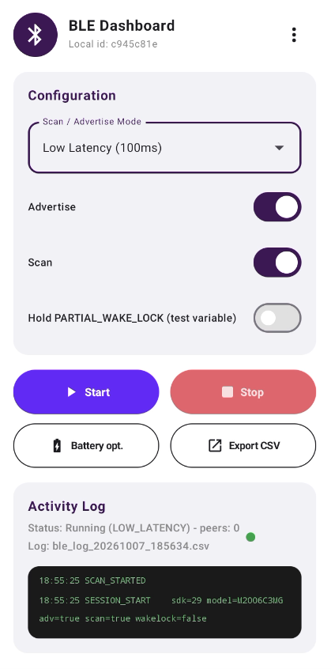

# 📡 BLE Spoonart

An Android application for **Bluetooth Low Energy (BLE)** proximity scanning, advertising, testing, and real-time activity logging built with **Jetpack Compose**, **Kotlin Coroutines**, **Hilt Dependency Injection**, and a **Multi-Module Architecture**.



---

## 🚀 Features

- **⚡ BLE Scanning & Advertising**: Easily test BLE proximity with configurable modes:
  - `Low Power (1000ms)`
  - `Balanced (250ms)`
  - `Low Latency (100ms)`
- **🔒 Continuous Background Service**: Uses an Android Foreground Service (`BleService`) to guarantee uninterrupted BLE scanning and advertising even when the screen is off or the app is in the background.
- **🔄 Coroutine-Powered Watchdog & Heartbeat**:
  - `BleWatchdog`: Automatically detects lost peers after `LOST_TIMEOUT_MS` timeout.
  - `BleHeartbeat`: Periodically logs active sighting statistics and resets window counters.
- **📱 Redesigned Jetpack Compose Dashboard**:
  - Modern Material 3 UI with configuration cards, switches, and quick-action buttons.
  - **Memory-efficient `LazyColumn` Log Viewer**: Handles long streams of log output without performance degradation and automatically scrolls to the newest log line.
- **🛡️ Robust Safety & Permission Handling**:
  - Full support for Android 12+ (`BLUETOOTH_SCAN`, `BLUETOOTH_ADVERTISE`, `BLUETOOTH_CONNECT`), Android 13+ (`POST_NOTIFICATIONS`), and Android 10–11 (`ACCESS_BACKGROUND_LOCATION`).
  - Automatic system prompt to turn on Bluetooth if disabled (`ACTION_REQUEST_ENABLE`).
  - Safe exception handling (`SecurityException`) preventing app crashes if permissions are manually revoked in App Info Settings.
- **📊 Real-Time CSV Logging & Export**:
  - Automatically logs event timestamps, peer IDs, RSSI, gap times, battery counters, and screen/keyguard lock state.
  - Instant CSV log sharing via Android `FileProvider`.

---

## 🏗️ Architecture & Project Modules

The project follows modern Android architecture guidelines and separation of concerns across 4 subprojects:

```
BLESpoonart/
├── :app              # Main entry point, Application class, Hilt setup & Activity
├── :core             # Core BLE Controller, Session Manager, Foreground Service, Watchdog/Heartbeat, & DI
├── :data             # Data persistence and repository layer
└── :feature-ble      # BLE Dashboard UI Composables, ViewModels, and UI resources
```

### Module Breakdown

| Module | Type | Description |
| :--- | :--- | :--- |
| **`:app`** | `ANDROID_APP` | Application container (`BLESpoonartApplication`), `MainActivity`, and root Hilt entry point. |
| **`:core`** | `ANDROID_LIBRARY` | Contains `BleService`, `BleSessionManager`, `BleControllerImpl`, `BleWatchdog`, `BleHeartbeat`, `EventLogger`, and Hilt `CoreModule`. |
| **`:data`** | `ANDROID_LIBRARY` | Handles data caching and persistence. |
| **`:feature-ble`**| `ANDROID_LIBRARY` | UI feature module containing `BleDashboard` composable, `BleDashboardViewModel`, and UI string resources. |

---

## 🛠️ Tech Stack & Dependencies

- **Language**: Kotlin 2.2.10
- **UI Framework**: Jetpack Compose (Material 3, Material Icons Extended)
- **Architecture**: MVVM + Clean Architecture / Multi-Module
- **Dependency Injection**: Hilt / Dagger (`2.60.1`)
- **Asynchronous / Concurrency**: Kotlin Coroutines & Flow
- **Code Processing**: KSP (Kotlin Symbol Processing `2.1.0-1.0.29`)
- **Min SDK**: API 26 (Android 8.0)
- **Compile SDK**: API 37

---

## 📱 Screenshots

| BLE Dashboard |
| :---: |
|  |

---

## 🔧 Building & Running the Project

### Prerequisites
- Android Studio Ladybug (or newer)
- JDK 11 or higher
- Android SDK 37

### Build Steps
1. Clone the repository:
   ```bash
   git clone https://github.com/spoonart1/BLESpoonart.git
   cd BLESpoonart
   ```
2. Build the project using Gradle:
   ```bash
   ./gradlew assembleDebug
   ```
3. Deploy to a connected Android device:
   ```bash
   ./gradlew installDebug
   ```

---

## 📄 License

```
Copyright (2026) BLE Spoonart
```
